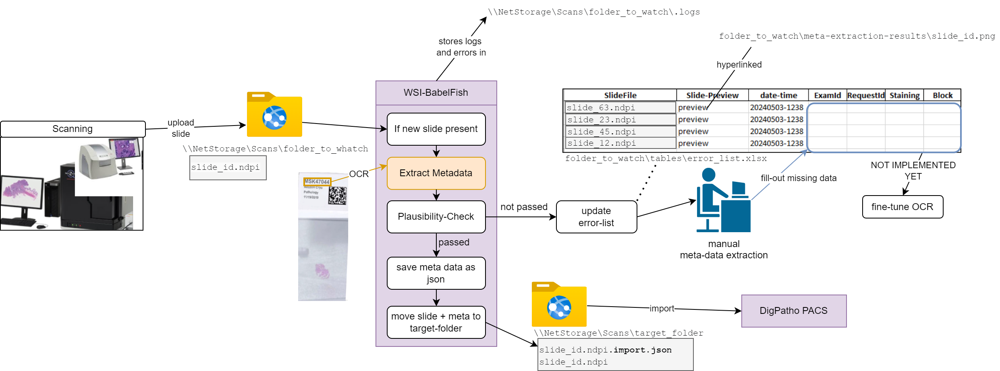

**!!! CODE COMING SOON !!!!**

This repo and the related paper is still under review and not yet ready for publication!
This repo will be freely available after the publication of the paper, which is expected to happen soon.

**!!! CODE COMING SOON !!!!**

#  WholeSlideImageFileBabelFish-Tool

WSI-BabelFish is a tool to extract meta information
like case number, year, slide number, block number etc. 
automatically from macro images of digital slides.

WSI-BabelFish is based on optical character recognition (OCR). For most information `easyOCR` is used. 
For the block number and cases with not enough results in the first OCR round, a second OCR with `pytesseract` is applied. 

## Intended use

This diagram shows the intended use of WSI-BabelFish:



It is designed to operate on an infrastructure where digital slides are uploaded to a network share (here: `folder_to_watch`).

WSI-BabelFish will watch this folder and extract the meta information from the uploaded slides using OCR tools.

The extracted meta information is saved as json file in the `target_folder` and the slide is moved to `target_folder`.

The extracted meta information can be used to import the slides into a database or PACS or LIS or to rename the slides.

A visualization of the results will be saved in the `folder_to_watch/meta-extraction-results/` directory as png files.

BableFish does also perform a plausibility check on the extracted meta information and will not save the json file if the plausibility check fails.
Failed slides will be collected in a table at `folder_to_watch/tables/implausible-results.xlsx`. This table can be used to manually correct the extracted meta information.
And a corrected table can be used to re-import the slides and to fine-tune the OCR over time.

Successful extracted data will be collected in a table at `folder_to_watch/tables/imparted_to_pacs.xlsx`. 

Errors and warnings will be logged in `folder_to_watch/.logs/` (this is a hidden directory!).

## How to configure WSI-BabelFish file management

Can be configured by editing the file `tools_FileObserving/slides_meta_data_extraction.json`:

WSI-BabelFish will watch the folder `folder_to_watch` (can be set in `slides_meta_data_extraction.json`) and trigger an event if
new files which match pattern `patterns` have been uploaded to `folder_to_watch`.

WSI-BabelFish will then extract the meta-data of the new imported slide and save it as json at 
`target_folder/slide-file.ndpi.json`. 

After the metadata extraction is done, WSI-BabelFish moves the slide to `target_folder/slide-file.ndpi`

WSI-BabelFish needs to be executed frequently using a task scheduler.
For this, one need to set up a scheduled task so that `/path/to/this/repo/main.py` gets executed each x minute.

#### windows:
We had some trouble to make WSI-BabelFish work together with the windows task scheduler. This was our solution:

1. Open the Windows Task Scheduler
2. Create a new task
3. Set the action to run a program
4. In the action-settings, enter `/path/to/this/repo/execute.bat` for "Program/Script" and enter `/path/to/this/repo` for "Start in" so that this will be used as working directory.
5. Now modify the `execute.bat` accordingly to your environment. 

#### linux:
On linux one can use crontab to schedule the execution of `/path/to/this/repo/main.py`. 
Feel free to edit this chapter if you have some experience with it!

## Installation

We recommend to first create a conda environment to install WSI-BabelFish, e.g. using 

```
conda create --name wsi_babblefish
conda activate wsi_babblefish
```

Next, install the following packages:

### Basic python packages:

(allways use `python -m pip` to ensure that it will be installed in the activated conda environment)

```
python -m pip install matplotlib
python -m pip install openpyxl
python -m pip install pandas
python -m pip install rapidfuzz
python -m pip install thefuzz
python -m pip install tqdm

```

### Install openslide:
OpenSlide Python requires OpenSlide, which must be installed separately.

On Linux and macOS, the easiest way to get both components is to use conda:

`conda install -c conda-forge openslide openslide-python`

On windows, see: https://openslide.org/api/python/#installing, then use `pip install openslide-python`

### Install easy OCR 
there will be things like torchvision be installed

``python -m pip install easyocr``

### Install pylibdmtx:

on Linux/OSX use:
```
pip install pylibdmtx or conda install conda-forge::pylibdmtx

brew install libdmtx
```  
on windows, get the `libdmtx.dll` manually from the web. We've found it [here](https://github.com/NaturalHistoryMuseum/pylibdmtx/issues/64).

Then, in get_name.py, import it like this in our python scripts:

```
PYLIBDMTX_PATH = r'C:\Users\...\.conda/envs\slide-processing\Lib\site-packages\pylibdmtx\libdmtx_64bit'
   with os.add_dll_directory(PYLIBDMTX_PATH):
       from pylibdmtx.pylibdmtx import decode
```

### Install pytesseract:

**On windows:**

Download and install tesseract 5.3:

https://tesseract-ocr.github.io/tessdoc/Installation.html

Add `\path\where\installed\Tesseract-OCR` to path environment variable

Check in terminal if command "tesseract" works.

Then install pytesseract into your environment using ``python -m pip install pytesseract``

**On Linux:**

Feel free to edit this chapter if you have some experience with it!